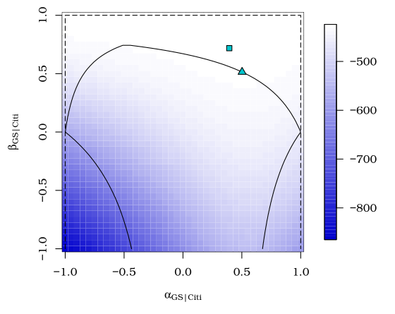

```{r setup, include=FALSE}
options(htmltools.dir.version = FALSE)
knitr::opts_chunk$set(
  fig.width=9, fig.height=3.5, fig.retina=3,
  out.width = "100%",
  cache = FALSE,
  echo = TRUE,
  message = FALSE, 
  warning = FALSE,
  fig.show = TRUE,
  hiline = TRUE
)
```

```{r xaringan-themer, include=FALSE, warning=FALSE}
library(xaringanthemer)
style_duo_accent(
  primary_color      = "#003C71", # pantone classic blue
  secondary_color    = "#009FDF", # pantone baby blue
  header_font_family = "D-DIN",
  text_font_google   = google_font("Cabin"),
  code_font_family = "Fira Code",
  code_font_url = "https://cdn.jsdelivr.net/gh/tonsky/FiraCode@2/distr/fira_code.css",
  #code_font_google   = google_font("Source Code Pro"),
  text_font_size     = "30px",
  inverse_header_color = "#FFFFFF"
)
```

count: false 

## Functionalities of the package

- Peaks-over threshold models


- Declustering method of Ferro & Segers (with bootstrap)


- **Multivariate conditional extremes** model of Heffernan–Tawn.


The latter is a **conditional** model (**threshold exceedances**) for a $D$ random vector $\{t_1(Y_1), \ldots, t_D(Y_D)\}$ with standardized **Laplace margins** given $t_j(Y_j) > u_j$.
---

## What is the Heffernan–Tawn model?

Assume that there exists scaling functions $\boldsymbol{a}_{|j}$ and $\boldsymbol{b}_{|j}$ with 
\begin{align*}
\small
Z_k(Y_j)=\frac{t_k(Y_k)-\boldsymbol{a}_{k|j}\{t_j(Y_j)\}}{\boldsymbol{b}_{k|j}\{t_j(Y_j)\}}
\end{align*}
such that asymptotically,
\begin{align*}
\small
\lim_{u_j \to \infty} \Pr\left( \left. \boldsymbol{Z}(Y_j) \leq \boldsymbol{z}, t(Y_j) > u_j+y;  \;\right| \; t_j(Y_j) > u_j\right) = H(\boldsymbol{z})\exp(-y)
\end{align*}
for $H$ a $D-1$ non-degenerate distribution function with $\lim_{z \to \infty} H_k(z) = 1$.

(remarks: factorization, random renormalization)

---

## Modelling approach: marginal transformation

  1. semiparametric model for $\widehat{F}_k$ $(k=1, \ldots, D)$
     - empirical distribution below $u_k$,
     - generalized Pareto above $u_k$.
  2. mapping $t_k$ transforms $Y_k$ to standard Laplace margins
  

(remark: Gumbel margins)

---


## Modelling approach: dependence model


- Assume limit relation holds exactly above $u_j$ large.
- Pick parametric forms for the normalizing constants: many examples of non-degenerate limits can be captured with
  - $\boldsymbol{a}_{|j}(x) = \boldsymbol{\alpha}_{|j}x$ and 
  - $\boldsymbol{b}_{|j}(x) = x^{\boldsymbol{\beta}_{|j}}$.

with $\boldsymbol{\alpha}_{|j} \in [-1,1]^{D-1}$ and $\boldsymbol{\beta}_{|j} \in [-\infty, 1]^{D-1}$.

---

## Dependence properties

The **coefficient of tail dependence** is
\begin{align*}
\lim_{u \to 1}\Pr\{F_k(Y_k) >u \mid F_j (Y_j) > u\} = \chi
\end{align*}
and we have 
- asymptotic independence if $\chi=0$ and 
- asymptotic dependence if $\chi>0$.

The Heffernan-Tawn implies a parametric form for $\chi(u)$.

---
## Tail dependence for conditional extremes model

Can show that components $Y_j$ and $Y_k$ are:
- **asymptotically dependent** only if $\alpha_{k|j}=1$, $\beta_{k|j}=0$
- **asymptotically independent** if $-1<\alpha_{k|j}<1$
    - positive extremal dependence if $\alpha_{k|j}>0$
    - negative extremal dependence if $\alpha_{k|j}<0$
    - near independence if $\alpha_{k|j}=\beta_{k|j}=0$.


Usually take $\beta_{k|j}\geq 0$ to avoid strange limiting behaviour.

---

## Semiparametric nonlinear regression model

\begin{align*}
t(\boldsymbol{Y}_{-j}) \approx \boldsymbol{\alpha}_{|j}y_j+y_j^{\boldsymbol{\beta}_{|j}}\boldsymbol{Z}
\end{align*}
with $\boldsymbol{\alpha}_{|j} \in [-1,1]^{D-1}$ and $\boldsymbol{\beta}_{|j} \in [-\infty, 1]^{D-1}$ and $\boldsymbol{Z}$ are unspecified residuals.


- (**pseudo-likelihood**) Fit the model assuming $\boldsymbol{Z} \sim \mathsf{No}_{D-1}(\boldsymbol{\mu}_{|j}, \mathrm{diag}\{\boldsymbol{\sigma}_{|j}^2\})$ with **nuisance parameters** $\boldsymbol{\mu}_{|j}$ and $\boldsymbol{\sigma}^2_{|j}$.

-  Equivalent to fitting a model for each of the $D-1$ margins separately with
\begin{align*}
t_k(Y_k) \mid t(Y_j)=y_j \sim \mathsf{No}\left(\alpha_{i|j}y_j + y_j^{\beta_{i|j}}\mu_{i|j}, y_j^{2\beta_{i|j}}\sigma^2_{i|j}\right), \qquad (i=1, \ldots, D; i \neq j)
\end{align*}

---

## Self-consistency

- In practice, we fit this model with each component in turn.
- Problems of self-consistency: need 
\begin{align*}
\Pr\{t_i(Y_i) > v, t_j(Y_j)>v\} &= \Pr\{t_i(Y_i) > v \mid t_j(Y_j)>v\}\Pr\{t_j(Y_j) > v\} \\&=
\Pr\{t_j(Y_j) > v \mid t_i(Y_i)>v\}\Pr\{t_i(Y_i) > v\}
\end{align*}
- Other constraints for ordering: 

negative dependence < asymptotic independence < asymptotic dependence.

- Keef, Papastathopoulos and Tawn (2013) propose new restrictions to accomodate the latter (improvement, but no cure)
  - leads to curved region for $a_{|j}$, $b_{|j}$ which complicates optimization
  - implemented in `texmex` for Laplace margins
  
---

## Visual representation of restriction

```{r figrestric, echo = FALSE, eval = TRUE, fig.align='center', fig.width=6, fig.height=3.5, fig.retina=1, out.width = "50%", fig.cap = "Profile log likelihood and parameter estimates - data are negative returns of Goldman Sachs given those of Citigroup;  extracted from Lugrin (2018) PhD thesis."}

```

---

## Simulating new extreme events

Estimation of probability in risk region  for which $Y_j > u_j$ via Monte Carlo simulations

Form $n$ vectors of residuals $\widehat{\boldsymbol{z}}_{i|j} = y_{ij}^{-\widehat{\boldsymbol{\beta}}_{|j}}\left(\boldsymbol{y}_{i,-j} - \widehat{\boldsymbol{\alpha}}_{|j}y_{ij}\right)$ $(i=1, \ldots, n)$.

**Extrapolation**: choose a threshold $v > u_j$

1. Simulate $Y_j \sim \mathsf{Exp}(1) + v$.
2. Sample $\boldsymbol{z}_{|j}$ uniformly from the empirical distribution $\{\widehat{\boldsymbol{z}}_{i|j}\}_{i=1}^n$.
3. Set $\boldsymbol{Y}_{-j}= \widehat{\boldsymbol{\alpha}}Y_j + Y_j^{\widehat{\boldsymbol{\beta}}}\boldsymbol{z}_{|j}$.
4. Back-transform observations to original scale.


(remark: dependence)

---

## Uncertainty quantification (bootstrap)


- nonparametric bootstrap sample (with replacement) from $\{\boldsymbol{Y}_i, \ldots, \boldsymbol{Y}_n\}$
- $D$ samples of size $n$ from the standard Laplace margins $\boldsymbol{Z}^{(b)}$.
- reorder Laplace observations so that the rank match that of the nonparametric bootstrap
- transform observations to data scale using $\widehat{F}_j^{-1}(\cdot)$ $(j=1, \ldots, D)$

Then, we re-estimate the following with the bootstrap data:
- empirical distribution
- generalized Pareto
- multivariate model

---

## Estimate risk 

To estimate the risk in region $\mathcal{A}$, break into regions $\mathcal{A}= \bigsqcup_{j=1}^D \mathcal{A}_j$ where 
\begin{align*}
\mathcal{A}_j = \{ t_j(Y_j) > u_j, F_j(Y_j) > F_k(Y_k) k=1, \ldots, D; k \neq j\}
\end{align*}

Then 
- simulate new observations (`predict`)
- count the fraction of points falling in $\mathcal{A}_j$.
- don't count points twice!
---

## Pros and cons of the Heffernan-Tawn model

### Benefits

- readily available software implementation!
- more flexible characterization than regular variation/threshold stable models
  - nondegenerate extrapolation for asymptotic independence
- semiparametric estimation

--
--- 
### Drawbacks

- lack of self-consistency
  - constraints for parameters $\boldsymbol{\alpha}_{|j}$ and $\boldsymbol{\beta}_{|j}$ are data-driven...
- *ad hoc* inference scheme
- curse of dimensionality

